## VERA platform screenshots

You can see this in action 
* at [demo.vera.jobs](https://demo.vera.jobs);
* watch [screencast](https://www.youtube.com/playlist?list=PLGRpxDadlmTP4SHkzDI_bu3AGFySxHipb) covering the entire hiring cycle (no sound, sorry). 

**[back to README](README.md)**
___
Index page and login form
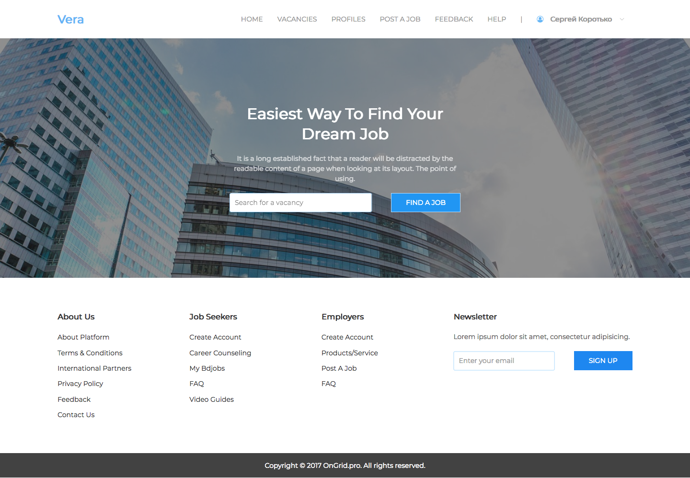

___
Vacancies search result
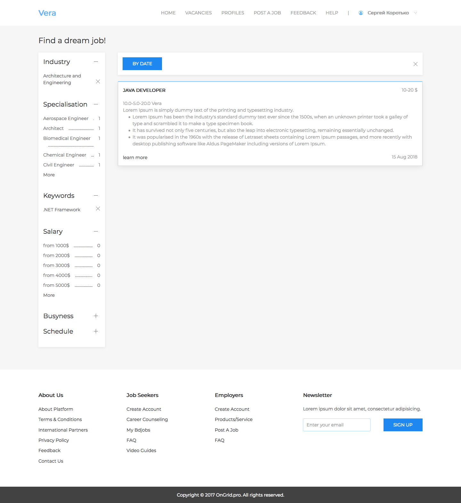

___
Vacancy details
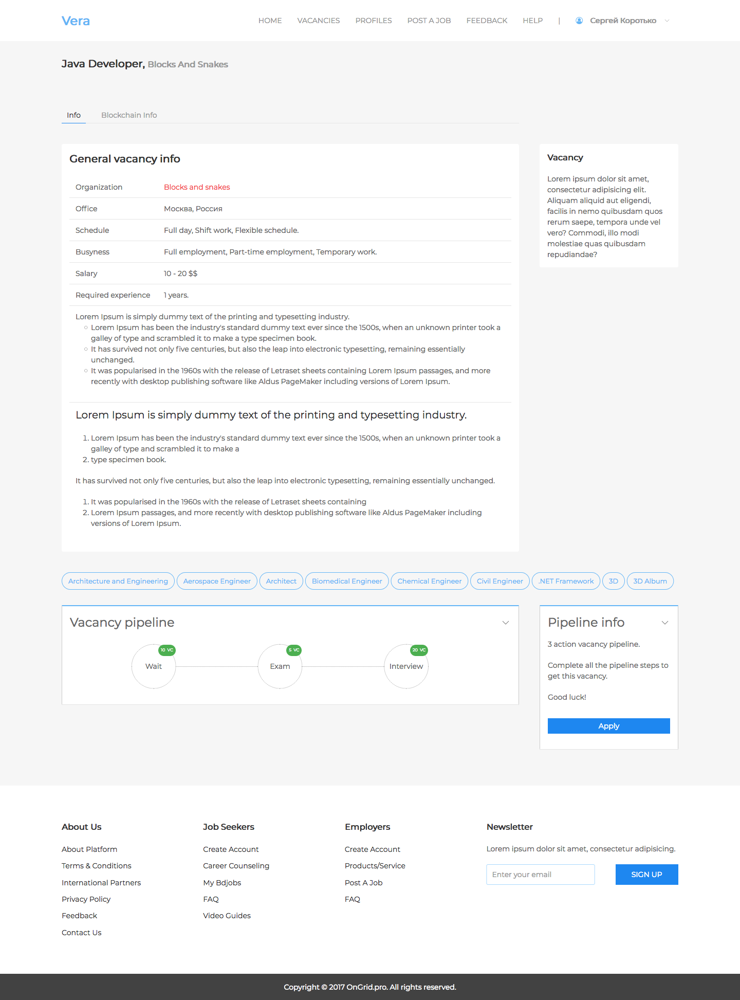

___
Candidate's blockchain artifacts
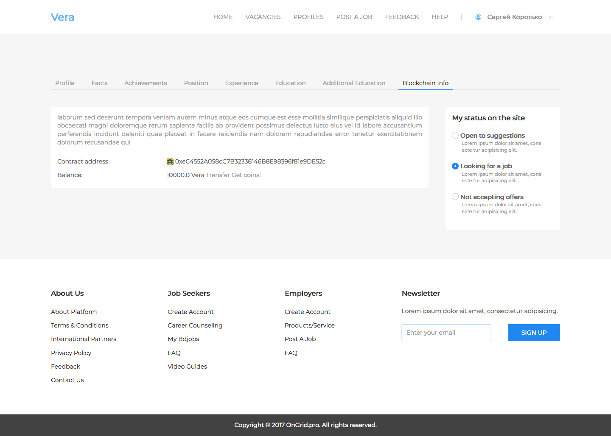

___
Candidate's facts and their confirmations 

To be refactored to claims/badges principles in v3.0
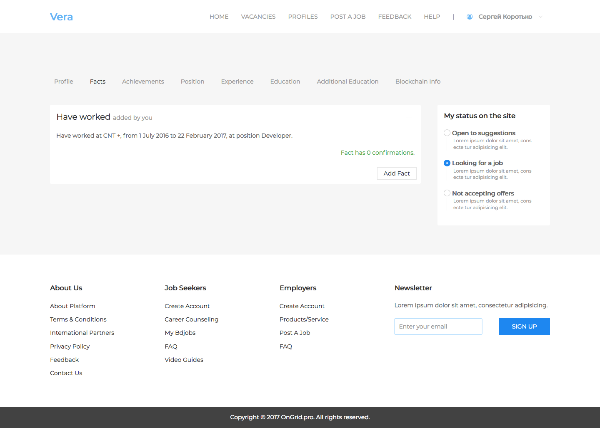

___
Candidate's profile
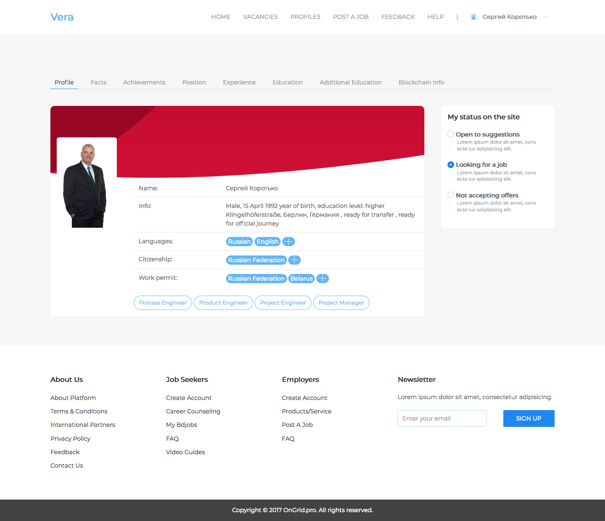

___
Candidate's blockchain transactions
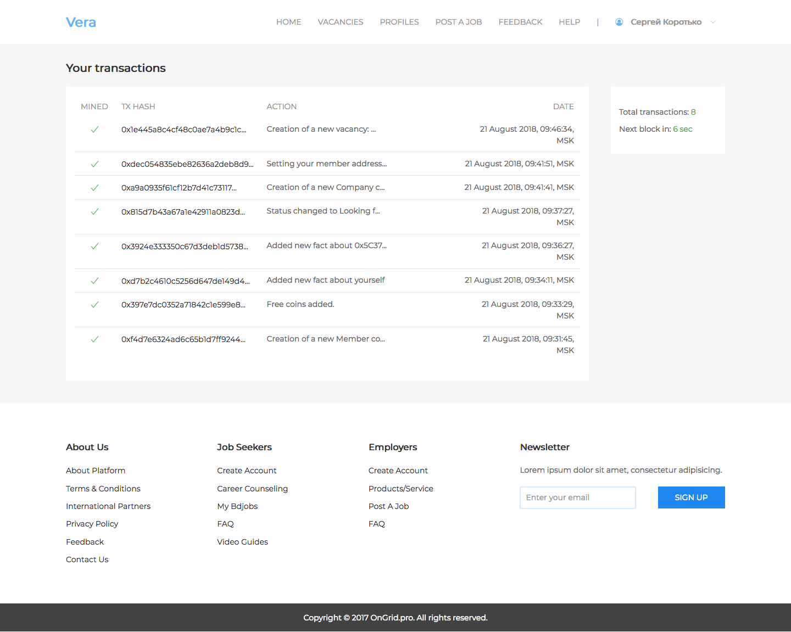

___
Vacancy details represented for the candidate. 

Vacancy pipeline shown and **Apply** button is available.
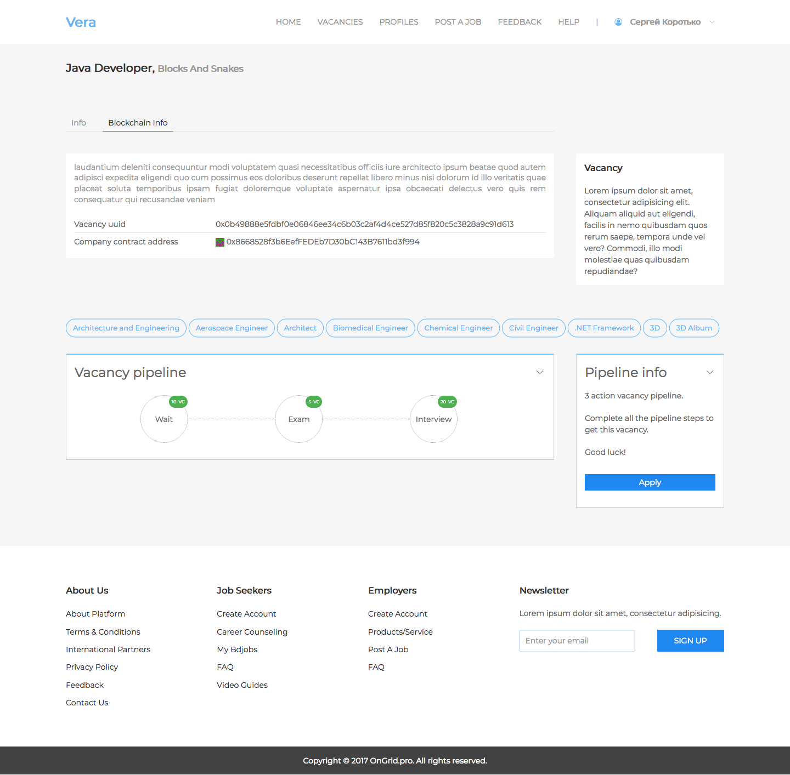

___
Blockchain artifact of the company - smartcontract.
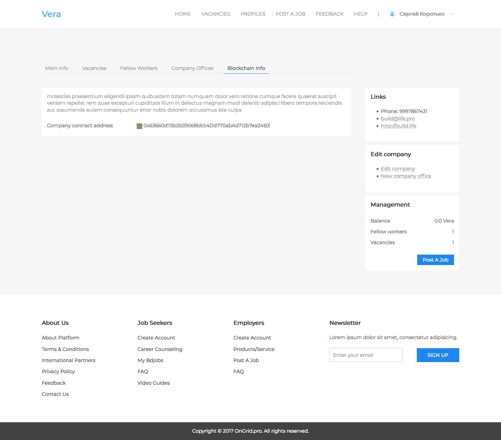

___
Company profile
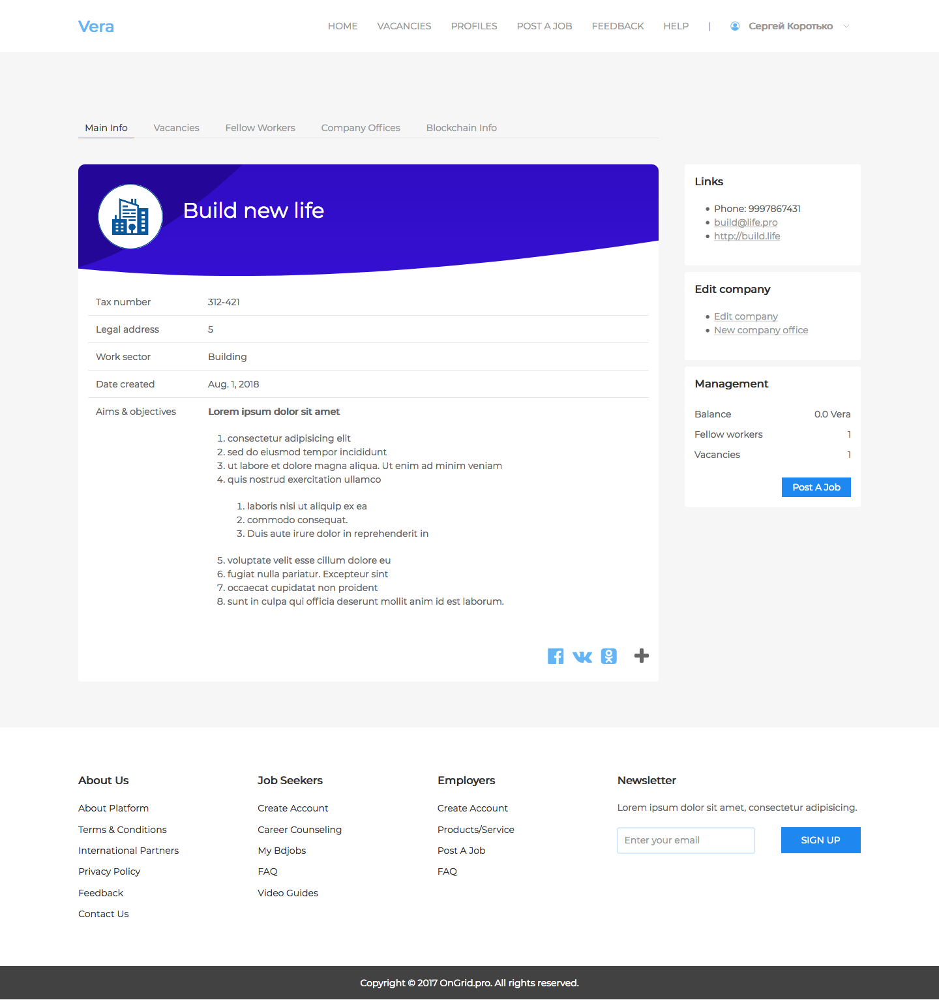

___
New vacancy form, 1st step.
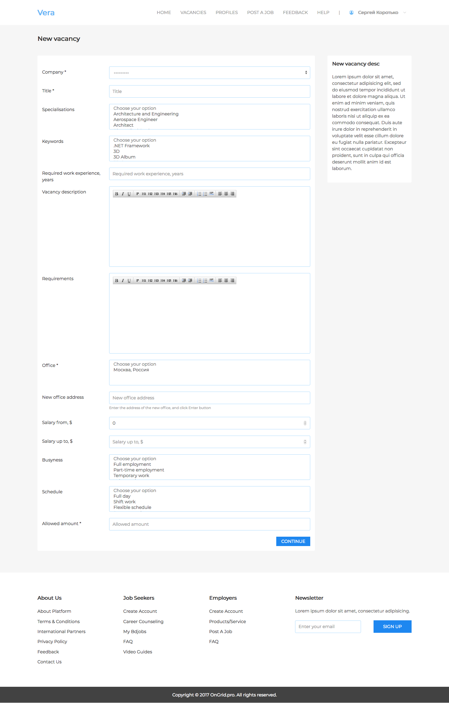

___
Quizz constructor (available for company's recruiter)
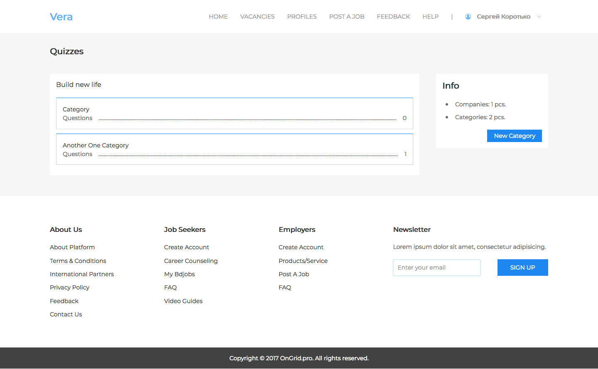

**[back to README](README.md)**